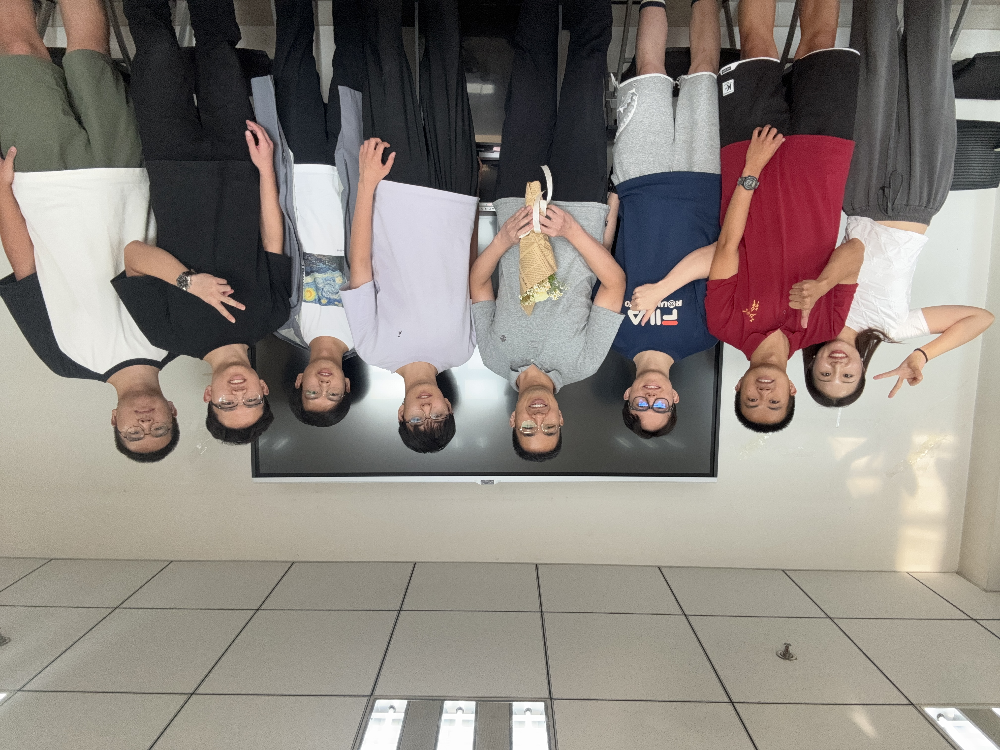

## About Me

I am a first-year **Master's student in Statistics at Renmin University of China**. I previously earned a Bachelor's degree in **Financial Mathematics and Financial Engineering at Shandong University**. 

I am currently interested in **statistical machine learning theory and methods, with a focus on temporal point processes and spectral inference.** Here are my CVs: [[CV(EN)]](assets/CV_MingZhang_en.pdf)[[CV(ZH)]](assets/CV_MingZhang_cn.pdf).

For more personal background, please see the Chinese page via the link in the top-right corner.

## Working Papers
Notes and ongoing projects are being organized.

## A Picture

From the left to the right are Li Jichu, Zhong Yilun, Wan Cheng, Zhang Jiaming, Prof. Zhou Feng, Zhang Haoran, me, and Li Zhiting.
